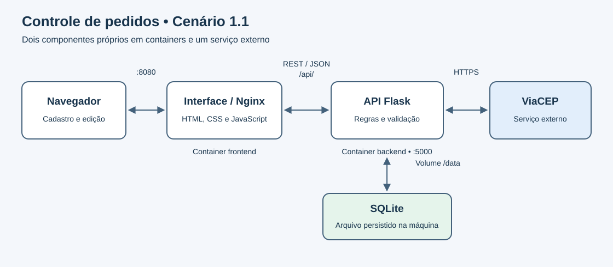

# Sistema de Controle de Pedidos

Interface HTML, CSS e JavaScript para registrar pedidos com cliente, produto, data de evento e endereço obtido pelo CEP. Permite listar, criar, editar pelo formulário e excluir pedidos, com confirmação de exclusão e mensagens de resultado.

## Produtos, valores e painel

A lista tem cinco produtos demonstrativos definidos em `client/produtos.js`. Ao escolher um, aparecem preço unitário e quantidade antes da data do evento. O preço pode ser ajustado por pedido e o total é calculado imediatamente. Edite esse arquivo para personalizar nomes e preços; os valores do catálogo são expressos em centavos.

Preço e quantidade são persistidos na API. Pedidos anteriores continuam disponíveis, com quantidade inicial 1 e preço não informado; na edição é possível informar o valor. O painel mostra contagem de pedidos, eventos a partir de hoje e soma dos pedidos com preço. A busca filtra por cliente ou produto. A exclusão usa uma janela de confirmação dentro da página.

## Programas e dependências

- **Com Docker:** Docker com Compose em execução e navegador. Python e Nginx são fornecidos pelas imagens; não precisam ser instalados separadamente na máquina.
- **Sem Docker:** Python 3.12 e navegador. As bibliotecas da API são instaladas pelo `requirements.txt` do backend, que também exige o arquivo `requirements.lock`.
- **Git:** necessário para os comandos de clonagem; se você já tem as pastas do projeto, pule a clonagem.
- **Internet:** necessária para obter dependências/imagens e consultar o ViaCEP.

O frontend não possui dependências de npm ou pip: seus arquivos HTML, CSS e JavaScript já estão em `client/`. Não é necessário Node.js. O `requirements.txt` contém bibliotecas Python, não programas do sistema nem os arquivos do frontend.

## Arquitetura



O projeto segue o cenário 1.1 do enunciado: interface + API própria + API externa. O navegador envia GET, POST, PUT e DELETE ao Nginx, que encaminha `/api/` à API Flask. A API consulta o ViaCEP por REST/JSON e persiste os pedidos no SQLite. O usuário permanece na aplicação durante a consulta externa.

## Execução completa com Docker

Requisitos: Git e Docker com Compose. Clone os dois repositórios em pastas irmãs com estes nomes:

```sh
git clone https://github.com/NetoEu/MVP-Arq.Software-FrontEnd.git frontEnd
git clone https://github.com/NetoEu/MVP-Arq.Software-BackEnd.git backEnd
cd frontEnd
docker compose up --build
```

Abra http://localhost:8080. Swagger da API: http://localhost:5000/openapi/swagger.

Antes de construir a imagem, confira que `client/config.js` contém `window.API_BASE_URL = "";`, para usar o proxy Nginx. Se você já tem as duas pastas na máquina, basta abrir o terminal em `frontEnd` e executar `docker compose up --build`.

O `docker-compose.yml` nesta raiz inicia os dois componentes. Se o backend estiver em outra pasta, configure `BACKEND_DIR` em um arquivo `.env`, por exemplo `BACKEND_DIR=../MVP-Arq.Software-BackEnd`.

Os pedidos ficam em `backEnd/server/database/db.sqlite3`, montado no container da API. Para parar: `docker compose down`. Reiniciar ou recriar os containers não apaga esse arquivo. Não inicie simultaneamente o Compose independente do backend.

O `Dockerfile` é o arquivo principal. `Dockerfile.frontend` foi mantido como alternativa compatível com comandos antigos; ambos usam o Nginx e precisam de um backend acessível pelo nome `backend` na rede Docker.

## Execução sem Docker

1. Inicie a API seguindo o README do backend.
2. Em `client/config.js`, defina `window.API_BASE_URL = "http://127.0.0.1:5000";`.
3. Na raiz do frontend, execute:

```sh
python -m http.server 8080 --directory client
```

4. Abra http://localhost:8080/pages/index.html.

### Windows: usar o Python da API, sem depender do PATH

Depois de preparar `.venv` conforme o README do backend, mantenha a API aberta em um terminal. Abra um segundo terminal na **pasta principal que contém `backEnd` e `frontEnd`** e execute:

```cmd
backEnd\.venv\Scripts\python.exe -m http.server 8080 --directory frontEnd\client
```

Se o segundo terminal estiver dentro de `frontEnd`, o comando equivalente é:

```cmd
..\backEnd\.venv\Scripts\python.exe -m http.server 8080 --directory client
```

Mantenha os dois terminais abertos. Interface: http://localhost:8080/pages/index.html. Rotas: http://localhost:5000/openapi/swagger. No Swagger, expanda a operação, clique em **Try it out**, preencha os campos e clique em **Execute**. Para parar, use **Ctrl+C** em cada terminal. Se a consulta de CEP falhar por certificado HTTPS, siga a seção de certificados do README do backend.

Antes de voltar ao Docker, restaure `window.API_BASE_URL = "";` para usar o proxy. Não é necessário instalar Node.js ou bibliotecas JavaScript.

## Comunicação com a API

| Ação na interface | Método e rota |
|---|---|
| Sair do campo CEP | `GET /api/cep/{cep}` |
| Carregar a lista | `GET /api/pedido` |
| Enviar pedido | `POST /api/pedido` |
| Salvar alterações | `PUT /api/pedido/{pedido_id}` |
| Confirmar exclusão | `DELETE /api/pedido/{pedido_id}` |

As datas são tratadas como dias de calendário, sem conversão de fuso. Os dados retornados são inseridos como texto, sem interpretação de HTML. A consulta de CEP descarta respostas antigas quando o usuário muda de CEP ou inicia outra edição.

## API externa: ViaCEP

- Documentação: https://viacep.com.br/.
- Rota consumida pelo backend: `GET https://viacep.com.br/ws/{cep}/json/`.
- Consulta gratuita, sem cadastro ou chave de autenticação.
- Não há licença específica de redistribuição da base declarada na página consultada; utilizamos somente a consulta de endereços. O provedor alerta para bloqueio em caso de uso massivo.
- CEP inexistente, formato inválido, indisponibilidade e timeout são tratados pela aplicação.

## Estrutura

- `client/pages/index.html`: formulário e lista.
- `client/components/interface/scripts.js`: chamadas REST e interação.
- `client/components/CSS/style.css`: apresentação.
- `client/config.js`: endereço da API para execução local.
- `nginx.conf`: página inicial e proxy da API.
- `docs/arquitetura.svg`: imagem da arquitetura.

## Verificação manual

1. Cadastre um pedido com CEP `01001000` e confira o endereço e a data.
2. Edite produto e data e confirme que a alteração persiste ao recarregar.
3. Troque o CEP e verifique a atualização do endereço.
4. Exclua o pedido e confirme que ele sai da lista.
5. Informe um CEP inválido e confira a mensagem de erro.
6. Reinicie os containers e verifique que os pedidos remanescentes continuam disponíveis.

Os testes automatizados da API estão no repositório do backend. Build e inicialização pelo Docker, acesso ao frontend, Swagger e consulta ViaCEP pelo proxy foram validados nesta máquina. Execute o checklist acima antes da entrega acadêmica.
